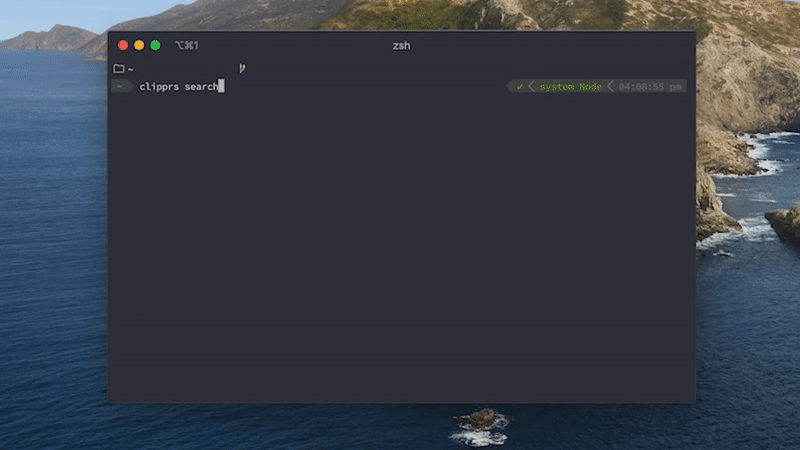
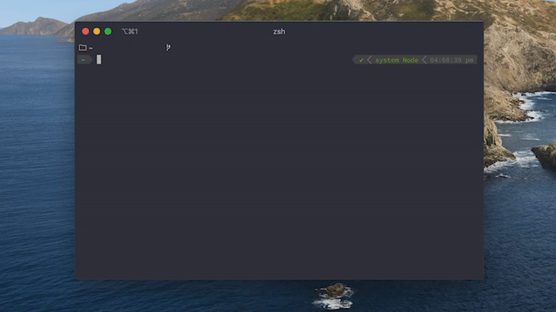

# Clipprs ✂️ - CLI Personal Relations System

 
 

 

 

x
## Why?

I built Clipprs to keep track of the little things that make up so much of the people we care about, and to help us all be better, less forgetful, and more compassionate friends. 

Throughout our lives we collect untold amounts of knowledge about the people we encounter. 

Try as we might, we're not equipped to handle the sheer volume of information that comes our way, and so we find ourselves forgetting lots of the little details that we encounter. 

Rather than try to battle against this, I've tried to accept this and build a tool to help me keep track of these details, without relying solely on my memory. 

While it may be a bit confronting at first to consider indexing information on the people around you, I believe it can help you to be more considerate and compassionate to the people you care about. 

## Quickstart guide

### Installation
- Install Clipprs with - 
    
      npm install -g clipprs

### Setup
  

  - This step is not necessary, but I highly recommend going through it to ensure your database file is backed up somewhere safe — especially as this project is still in its infancy. 

  - Run - 

        clipprs setup

        ? What would you like to change? … 
        ❯ Database File Path
          Table Column Widths

  - We are going to change the database file path from the default directory to one which is backed up. 
  
  - For this, I use the [Google Drive](https://www.google.com/drive/download/) desktop application which keeps a folder on my local machine in sync with my Google Drive. There are many other providers (Dropbox, Mega etc.) which all have similar offerings. 

  - After selecting "Database File Path" you will be prompted to enter a new path to store the file, with the default path displayed. Only the path is required, the filename is automatically inserted - 

        ✔ What would you like to change? · Database File Path
        ? Enter a new location to save the database file (TAB to autocomplete)
        › /Users/harrisonbroadbent/Documents/projects/clipprs

        · /Users/harrisonbroadbent/Google Drive/life/clipprs
        Updated path to /Users/harrisonbroadbent/Google Drive/life/clipprs

  - This will keep the clipprs_db.json file backed up, and will also allow you to work across different machines by pointing all your Clipprs instances at the db file. 

### Add
  -  Add a new clip to your system with -
  
    > clipprs new

    ? Add a person to your Clips -  … 
    First Name :  
    Last Name  : …
    Birthday   : …
    Bio        : …

  You can use *ctrl + n* to add fields and *ctrl + r* to remove fields. 
  
  Note that the four initial fields are required and cannot be removed. 

### View

  -  View all your clips with -
  
    > clipprs view

    ┌────────────────┬────────────────┬────────────────┬────────────────┐
    │ First Name     │ Last Name      │ Birthday       │ Bio            │
    ├────────────────┼────────────────┼────────────────┼────────────────┤
    │ Steve          │ Austin         │ ???            │ He is stone    │
    │                │                │                │ cold.          │
    ├────────────────┼────────────────┼────────────────┼────────────────┤
    │ Harrison       │ Broadbent      │ 21-02-2002     │ Engineering    │
    │                │                │                │ student, likes │
    │                │                │                │ to run and     │
    │                │                │                │ code, eats a   │
    │                │                │                │ lot.           │
    └────────────────┴────────────────┴────────────────┴────────────────┘

  By default, this will only show the four required fields, like above. 
  You can view all the fields within your database of clips by passing the -a flag - 

    > clipprs view -a

  This will attempt to show you the value of each entry for all the fields in your database, with blanks used to show an undefined field, ie - 

      ┌────────────────┬────────────────┬────────────────┬────────────────┬────────────────┐
      │ First Name     │ Last Name      │ Birthday       │ Bio            │ Favourite      │
      │                │                │                │                │ Colour         │
      ├────────────────┼────────────────┼────────────────┼────────────────┼────────────────┤
      │ Steve          │ Austin         │ ???            │ He is stone    │                │
      │                │                │                │ cold.          │                │
      ├────────────────┼────────────────┼────────────────┼────────────────┼────────────────┤
      │ Harrison       │ Broadbent      │ 21-02-2002     │ Engineering    │ Carolina blue  │
      │                │                │                │ student, likes │                │
      │                │                │                │ to run and     │                │
      │                │                │                │ code, eats a   │                │
      │                │                │                │ lot.           │                │
      └────────────────┴────────────────┴────────────────┴────────────────┴────────────────┘

  If the table containing all the fields in the database is too wide for the terminal however, the table will be truncated and only show a portion of all the fields. 

  All the fields for a given entry can be viewed by searching for an entry and then viewing it, as discussed in the following section. 

### Search

  

  -  Search, Edit, View and Delete your clips -
  
    > clipprs search

    ? Search and edit your Clips -  …
    Harrison Broadbent
    Steve Austin

  Select a clip with *enter*, and then select from the given options using the arrow keys - 

    ?  …
    ❯ View
      Edit
      Delete
      Close

  - **View**: Shows an extended view of *all* fields for a given entry.
  - **Edit**: Allows you to edit the entry, add and remove fields etc.
  - **Delete**: Deletes an entry after confirmation.
  - **Close**: Closes the dialogue.

  

### Erase
  - You can erase your database of clips using - 
    
        > clipprs erase

    and then choosing (y) for both of the confirmations. 
    
    THIS CANNOT BE UNDONE!

### Help
  - At any time, you can get help using - 
    
        > clipprs help  
        
        // OR

        > clipprs help [command]
